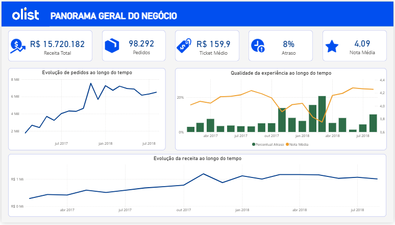
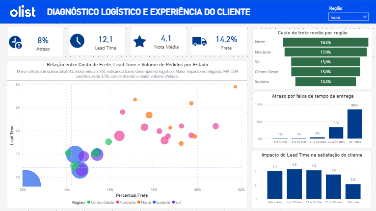

# Olist Logistics Analytics

## Business Context

This project was developed as part of the Postech Data Analytics Tech Challenge, with the objective of understanding how logistics variables impact customer experience in an e-commerce operation.

Using the Olist public dataset, the analysis investigates operational performance, customer satisfaction, freight costs, delivery lead time, and regional logistics challenges.

---

## Business Question

Which logistics variables most impact customer experience, and where should operational improvement efforts be prioritized?

---

## Dataset

Public e-commerce dataset from Olist, including:

- Orders
- Order items
- Payments
- Customer reviews
- Freight costs
- Seller and customer geolocation

---

## Project Workflow

The project was structured in four analytical stages:

### 1. Data Preparation
Data cleaning and validation were performed using Python, including:

- Null value treatment
- Date conversion
- Dataset joins
- Feature engineering

### 2. Feature Engineering
Creation of business metrics such as:

- Delivery Lead Time
- Delivery Delay
- Freight Percentage
- Revenue Indicators
- Regional Classification

### 3. Exploratory Data Analysis
Analysis of:

- Order growth over time
- Revenue evolution
- Delay patterns
- Customer review behavior

### 4. Prioritization Model
Development of two strategic indicators:

#### Operational Criticality Score

Weighted model based on:

- Delay Rate (**40%**)
- Customer Review Score (**25%**)
- Freight Percentage (**20%**)
- Lead Time (**15%**)

#### Business Impact Score

Combination of:

Operational Criticality × Order Volume

---

## Main Insights

Key findings from the analysis:

- States in North and Northeast regions showed the highest logistics costs and lead times.
- Maranhão presented the highest operational impact.
- Alagoas showed the highest operational criticality.
- Rio de Janeiro presented the largest improvement opportunity due to scale.

Examples:

| State | Freight % | Lead Time | Orders | Review Score |
|-------|-----------|-----------|--------|--------------|
| RR | 21.7% | 29 days | 44 | 3.66 |
| MA | 20.8% | 21 days | 734 | 3.76 |
| RJ | 14.4% | 15 days | 12,695 | 3.88 |

---

## Tools Used

- Python
- Pandas
- NumPy
- Google Colab
- Power BI

---

## Repository Structure

```bash
├── notebooks/
├── images/
├── dashboard/
├── README.md
```

---

## Dashboard

The final dashboard was built in Power BI and divided into three analytical layers:

### 1. Business Overview



### 2. Logistics Diagnosis



### 3. Operational Prioritization


---

## Author

Lia Stiegler  
Forest Engineer | Data Analytics | Power BI | Process Automation
